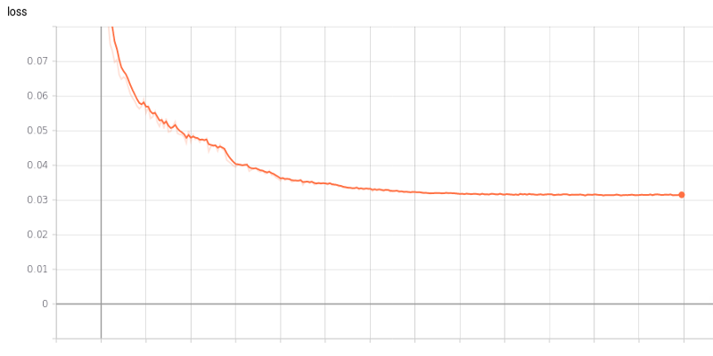
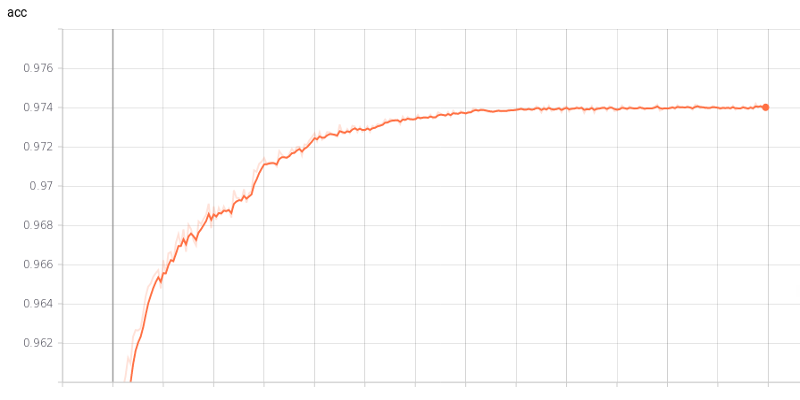
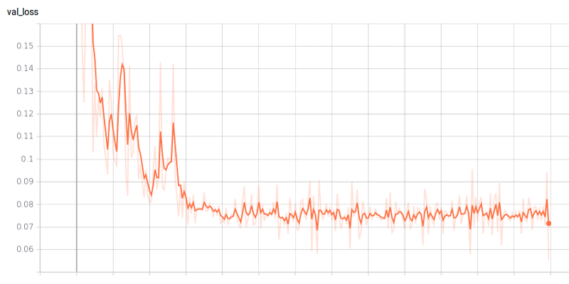
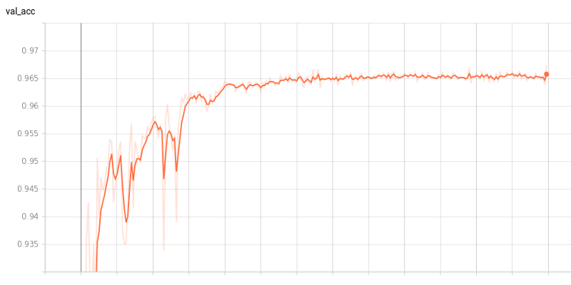
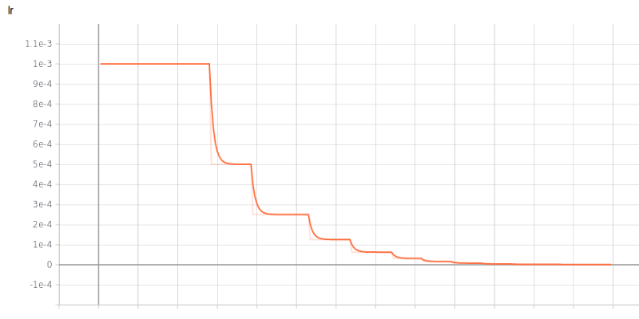
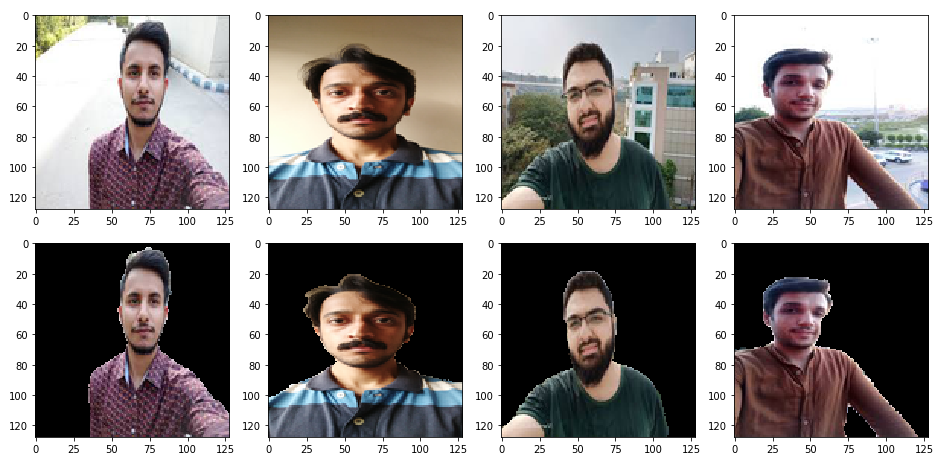
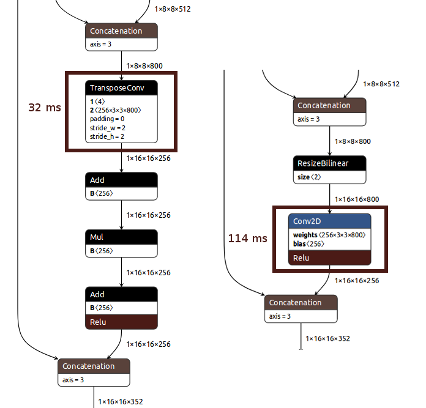
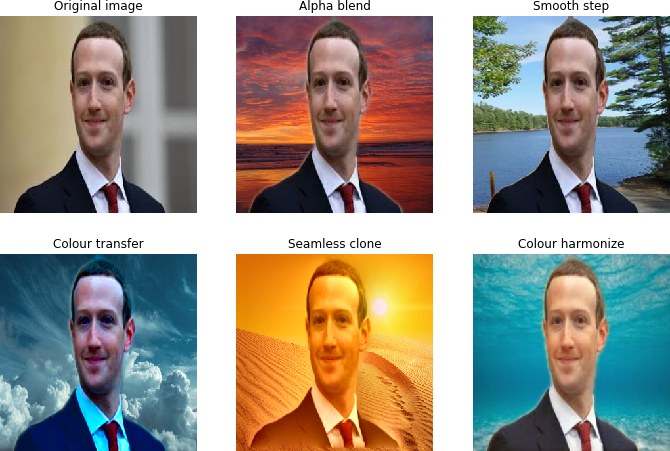

# Portrait-Segmentation

**Real-time Automatic Deep Matting For Mobile Devices With Mobile-Unet**

**Portrait segmentation** refers to the process of segmenting a person in an image from its background.
Here we use the concept of **semantic segmentation** to predict the label of every pixel (dense prediction) in an image.

Here we limit ourselves to **binary classes** (person or background) and use only plain **portrait-selfie** images for matting.

## Dependencies

* Tensorflow(>=1.14.0), Python 3
* Keras(>=2.2.4), Kito
* Opencv(>=3.4), PIL, Matplotlib

```
pip uninstall -y tensorflow
pip install -U tf-nightly
pip install keras
pip install kito
```

## Prerequisites

* Download training [data-set](https://drive.google.com/file/d/1UBLzvcqvt_fin9Y-48I_-lWQYfYpt_6J/view?usp=sharing)
* GPU with CUDA support
* Download caffe harmonization [model](https://drive.google.com/file/d/1bWafRdYBupr8eEuxSclIQpF7DaC_2MEY/view?usp=sharing)

## Dataset

The dataset consists of **18698 human portrait images of size 128x128 in RGB format**, along with their **masks(ALPHA)**. Here we augment the [**PFCN**](https://1drv.ms/u/s!ApwdOxIIFBH19Ts5EuFd9gVJrKTo) dataset with (handpicked) portrait  images form **supervisely** dataset. Additionaly, we download **random selfie** images from web and generate their masks using state-of-the-art **deeplab-xception** model for semantic segmentation. 

Now to increase the size of dataset, we perform augmentation like **cropping, brightness alteration and flipping**. Since most of our images contain plain background, we create new **synthetic images** using random backgrounds (natural) using the default dataset, with the help of a **python script**.

Besides the aforesaid augmentation techniques, we **normalize(also standardize)** the images and perform **run-time augmentations like flip, shift and zoom** using keras data generator and preprocessing module.

## Model Architecture

Here we use **Mobilent v2** with **depth multiplier 0.5** as encoder (feature extractor).

For the **decoder part**, we have two variants. You can use a upsampling block with either  **Transpose Convolution** or **Upsample2D+Convolution**. In the former case we use a **stride of 2**, whereas in the later we use **resize bilinear** for upsampling, along with Conv2d. Ensure proper **skip connections** between encoder and decoder parts for better results.

Additionaly, we use **dropout** regularization to prevent **overfitting**.It also helps our network to learn more **robust** features during training.

Here is the **snapshot** of the **upsampled** version of model.


## How to run

Download the **dataset** from the above link and put them in **data** folder.
After ensuring the data files are stored in the **desired directorires**, run the scripts in the **following order**.

```python
1. python train.py # Train the model on data-set
2. python eval.py checkpoints/up_super_model-102-0.06.hdf5 # Evaluate the model on test-set
3. python export.py checkpoints/up_super_model-102-0.06.hdf5 # Export the model for deployment
4. python test.py test/four.jpeg # Test the model on a single image
5. python webcam.py test/beach.jpg # Run the model on webcam feed
6. python segvideo.py test/sunset.jpg # Apply blending filters on video
```
You may also run the **Jupyter Notebook** (ipynb) in google colaboratory, after downloading the training dataset.

In case you want to train with a **custom dataset**, check out the scripts in **utils** directory for data preparation.

## Training graphs

Since we are using a **pretrained mobilentv2** as encoder for a head start, the training **quickly converges to 90% accuracy** within first couple of epochs. Also, here we use a flexible **learning rate schedule** (ReduceLROnPlateau) for training the model.


### Training Loss



### Training Accuracy



### Validation Loss



### Validation Accuracy



### Learning Rate Schedule




## Demo

### Result

#### 1. Model Type - 1
Here the **inputs and outputs** are images of size **128x128**.The backbone is **mobilenetv2** with **depth multiplier 0.5**. 
The **first row** represents the **input** and the **second row** shows the corresponding **cropped image** obtained by cropping the input image with the **mask output** of the model.



**Accuracy: 96%**, 
**FPS: 10-15**

#### 2. Model Type - 2
Here the **inputs and outputs** are images of size **224x224**. The backbone is **mobilenetv3** with **depth multiplier 1.0**.
The **first row** represents the **input** and the **second row** shows the corresponding **cropped image** obtained by cropping the input image with the **mask output** of the model.


**Accuracy: 97%**, 
**FPS: 10-15**

**NB:** Accuracy measured on a predefined test data-set and FPS on the android application, using Oneplus3.
### Android Application

Real-time portrait video in android application

<p align="left">
  
</p>

(Shot on OnePlus 3 😉)

### Model running time

Summary of model size and runnig time in android

| Model Name | CPU Time (ms) | GPU Time (ms)| Parameters (M) | Size (MB)
|----|----|----|----|-----|
| **deconv_fin_munet.tflite** | 165 | 54  |  3.624 |  14.5 |
| **bilinear_fin_munet.tflite**  | 542  | 115 |  3.620 |  14.5 |
| **munet_mnv3_wm10.tflite**  | 167  | 59.5 |  2.552 |  10.2 |
| **munet_mnv3_wm05.tflite**  | 75  | 30 |  1.192 |  4.8 |

The parameter 'wm' refers to the **width multiplier** (similar to depth multiplier). We can configure the **number of filters** of particular layers and adjust the **speed-accuracy tradeoffs** of the network using this paramter. 

#### CPU Profiling :-

The benchmark tool allows us to profile the running time of **each operator in CPU** of the mobile device. Here is the summary of the operator profiling. 

**1. Deconv model**

$ adb shell /data/local/tmp/benchmark_model_tf14 --graph=/data/local/tmp/deconv_fin_munet.tflite --enable_op_profiling=true --num_threads=1

```
Number of nodes executed: 94
============================== Summary by node type ==============================
	             [Node type]	  [count]	  [avg ms]	    [avg %]	    [cdf %]	  [mem KB]	[times called]
	          TRANSPOSE_CONV	        6	   130.565	    79.275%	    79.275%	     0.000	        6
	                     ADD	       21	    13.997	     8.499%	    87.773%	     0.000	       21
	                 CONV_2D	       34	     8.962	     5.441%	    93.215%	     0.000	       34
	                     MUL	        5	     7.022	     4.264%	    97.478%	     0.000	        5
	       DEPTHWISE_CONV_2D	       17	     3.177	     1.929%	    99.407%	     0.000	       17
	           CONCATENATION	        4	     0.635	     0.386%	    99.793%	     0.000	        4
	                     PAD	        5	     0.220	     0.134%	    99.927%	     0.000	        5
	                LOGISTIC	        1	     0.117	     0.071%	    99.998%	     0.000	        1
	                 RESHAPE	        1	     0.004	     0.002%	   100.000%	     0.000	        1

Timings (microseconds): count=50 first=164708 curr=162772 min=162419 max=167496 avg=164746 std=1434
```

**2. Bilinear model**

$ adb shell /data/local/tmp/benchmark_model_tf14 --graph=/data/local/tmp/bilinear_fin_munet.tflite --enable_op_profiling=true --num_threads=1

```
Number of nodes executed: 84
============================== Summary by node type ==============================
	             [Node type]	  [count]	  [avg ms]	    [avg %]	    [cdf %]	  [mem KB]	[times called]
	                 CONV_2D	       39	   534.319	    98.411%	    98.411%	     0.000	       39
	         RESIZE_BILINEAR	        5	     3.351	     0.617%	    99.028%	     0.000	        5
	       DEPTHWISE_CONV_2D	       17	     3.110	     0.573%	    99.601%	     0.000	       17
	          TRANSPOSE_CONV	        1	     0.871	     0.160%	    99.761%	     0.000	        1
	           CONCATENATION	        4	     0.763	     0.141%	    99.901%	     0.000	        4
	                     PAD	        5	     0.246	     0.045%	    99.947%	     0.000	        5
	                     ADD	       11	     0.166	     0.031%	    99.977%	     0.000	       11
	                LOGISTIC	        1	     0.119	     0.022%	    99.999%	     0.000	        1
	                 RESHAPE	        1	     0.004	     0.001%	   100.000%	     0.000	        1

Timings (microseconds): count=50 first=544544 curr=540075 min=533873 max=551555 avg=542990 std=4363
```

The **upsamling block** in the **bilinear model** seems to be **expensive** than the corresponding block in deconv model.This seems to be due to the the convolution layer using a **stride of 1** with a larger image size with **more channels**; whereas in the case of transpose convoltuion we use a **stride of 2**, with **lesser channels**.



* Unfortunately, the benchmark tool doesn't allow **gpu operator profiling**. 
* For the current models, it  was observed that **single threaded CPU** execution was faster than multithreaded execution.
* Also, if you properly **fuse** layers like  Add, Mul etc. and **eliminate** layers like Pad you may gain couple of milliseconds on GPU (may be more on CPU).
* We were unable to properly run the current models in NNAPI or FP16 mode due to some operator and compatibility issues. 

**Note**: All timings measured using [tflite benchmark tool](https://github.com/tensorflow/tensorflow/tree/master/tensorflow/lite/tools/benchmark) on OnePlus3.

### The Paradoxical GPU

Lets create some simple keras models to demonstrate and compare gpu performance with cpu ...

1. Model-1

It has a convolution layer with a 3x3 identity kernel.
```
Model: "model_1"
_________________________________________________________________
Layer (type)                 Output Shape              Param #   
=================================================================
input_1 (InputLayer)         (None, 256, 256, 1)       0         
_________________________________________________________________
conv2d_1 (Conv2D)            (None, 256, 256, 1)       10        
=================================================================
Total params: 10
Trainable params: 10
Non-trainable params: 0
_________________________________________________________________
```
2. Model-2

It has one convolution layer with identity kernel and a special 1x16 kernel for data compression.
```
Model: "model_2"
_________________________________________________________________
Layer (type)                 Output Shape              Param #   
=================================================================
input_2 (InputLayer)         (None, 256, 256, 1)       0         
_________________________________________________________________
conv2d_2 (Conv2D)            (None, 256, 256, 1)       10        
_________________________________________________________________
conv2d_3 (Conv2D)            (None, 256, 16, 1)        17        
=================================================================
Total params: 27
Trainable params: 27
Non-trainable params: 0
_________________________________________________________________
```
3. Model-3

It is similar to model 1; but it has four channels instead of one.
```
Model: "model_3"
_________________________________________________________________
Layer (type)                 Output Shape              Param #   
=================================================================
input_3 (InputLayer)         (None, 256, 256, 4)       0         
_________________________________________________________________
conv2d_4 (Conv2D)            (None, 256, 256, 4)       148       
=================================================================
Total params: 148
Trainable params: 148
Non-trainable params: 0
```

4. Model-4

The model is simialr to model-3.
The input channels are four and  we add an additional reshape layer at the end.

```
Model: "model_4"
_________________________________________________________________
Layer (type)                 Output Shape              Param #   
=================================================================
input_4 (InputLayer)         (None, 256, 256, 4)       0         
_________________________________________________________________
conv2d_5 (Conv2D)            (None, 256, 256, 1)       37        
_________________________________________________________________
conv2d_6 (Conv2D)            (None, 256, 16, 1)        17        
_________________________________________________________________
reshape_1 (Reshape)          (None, 256, 16)           0         
=================================================================
Total params: 54
Trainable params: 54
Non-trainable params: 0
```

5. Model-5

The model is similar to model-4. 
It has an additional reshape operator for resizing the flattened input tensor.

```
Model: "model_5"
_________________________________________________________________
Layer (type)                 Output Shape              Param #   
=================================================================
input_1 (InputLayer)         (None, 196608)            0         
_________________________________________________________________
reshape_1 (Reshape)          (None, 256, 256, 3)       0         
_________________________________________________________________
conv2d_1 (Conv2D)            (None, 256, 256, 1)       28        
_________________________________________________________________
conv2d_2 (Conv2D)            (None, 256, 16, 1)        17        
_________________________________________________________________
reshape_2 (Reshape)          (None, 256, 16)           0         
=================================================================
Total params: 45
Trainable params: 45
Non-trainable params: 0
```

6. Model-6

It is similar to model-5.
Here we use strided slice operator to remove the fourth channle from input instead of reshape.

```
Model: "model_6"
_________________________________________________________________
Layer (type)                 Output Shape              Param #   
=================================================================
input_1 (InputLayer)         (None, 256, 256, 4)       0         
_________________________________________________________________
lambda_1 (Lambda)            (None, 256, 256, 3)       0         
_________________________________________________________________
conv2d_1 (Conv2D)            (None, 256, 256, 1)       28        
_________________________________________________________________
conv2d_2 (Conv2D)            (None, 256, 16, 1)        17        
_________________________________________________________________
reshape_1 (Reshape)          (None, 256, 16)           0         
=================================================================
Total params: 45
Trainable params: 45
Non-trainable params: 0
```

7. Model-7

It is similar to mode-3.
Herw we use strided-slice to remove the fourth channel of input and pad operator to make the number of channels of output=4.

```
Model: "model_7"
_________________________________________________________________
Layer (type)                 Output Shape              Param #   
=================================================================
input_1 (InputLayer)         (None, 256, 256, 4)       0         
_________________________________________________________________
lambda_1 (Lambda)            (None, 256, 256, 3)       0         
_________________________________________________________________
conv2d_1 (Conv2D)            (None, 256, 256, 1)       28        
_________________________________________________________________
lambda_2 (Lambda)            (None, 256, 256, 4)       0         
=================================================================
Total params: 28
Trainable params: 28
Non-trainable params: 0
```

Now, lets convert them into tflite and benchmark their performance ....

| Model Name | CPU Time (ms) | GPU Time (ms)| Parameters | Model Size (B) |  Input Shape | Output Shape |
|----|----|----|----|-----|-----|-----|
| **model-1** | 3.404 | 16.5  |  10 |  772 | 1x256x256x1 | 1x256x256x1 |
| **model-2**  | 3.610  | 6.5 |  27 |  1204 | 1x256x256x1 | 1x256x16x1 |
| **model-3** | 10.145 | 4.8  |  148 |  1320 | 1x256x256x4 | 1x256x256x4 |
| **model-4**  | 7.300  | 2.7 |  54 |  1552 | 1x256x256x4 | 1x256x16 |
| **model-5**  | 7.682  | 4.0 |  45 |  1784 | 1x196608 | 1x256x16 |
| **model-6**  | 7.649  | 3.0 |  45 |  1996 | 1x256x256x4 | 1x256x16 |
| **model-7**  | 9.283  | 5.7 |  28 |  1608 | 1x256x256x4 | 1x256x256x4 |


Clearly, the second model has one extra layer than the first model and their final output shapes differ slightly.
Comparing the cpu speed of the two models, there is no surprise i.e The second model(bigger) takes slightly more time than the first.

However, if you compare the cpu performance of a model with the gpu performance, it seems counter-intutive !!!

**The cpu takes less time than gpu !!!**

Similarly, if you compare the gpu speed of the two models, the  **second one(bigger) seems to be faster than the first one**, which is again contrary to our expectations !!!

So why is this happening ??? Enter the **IO** ...

It looks like something other than 'our model nodes' are taking up time, behind the scenes. If you closely observe, the **output shape** of the second model is smaller(256 vs 16). In the case of a gpu (mobile-gpu particularly), the input data is initially copied to the gpu memory from main memory (or cache) and finally after execution the result is copied back to the main memory (or cache) from the gpu memory. This **copy process takes considerable amount of time**  and is normally proportional to data size and also depend on the hardware, copy mechanism etc. Also, for considerable speed-up the **gpu should be fed with a larger model or data**; otherwise the gains in terms of speed-up will be small. In the extreme cases(i.e very small inputs) the **overheads will outweigh the possible benefits**. 

In our case, around 10ms(worst case) is taken for gpu copy or IO and this corresponds to the difference in output data size(or shape) mostly.

**So, for this difference ...
i.e 256x256 - 256x16 = 61440 fp32 values = 61440x4 Bytes = 245760 Bytes ~ 240KB 
it takes about 10ms extra copy time !!!**

However, you can avoid this problem by using **SSBO and and opengl**, as described in the [tflite-gpu documentation](https://www.tensorflow.org/lite/performance/gpu_advanced#inputoutput_buffers).

For more info refer github issue: [Tensorflow lite gpu delegate inference using opengl and SSBO in android](https://github.com/tensorflow/tensorflow/issues/26297)

Anyway, i haven't figure it out yet ... 😜

But wait.. what was that **special filter** that we mentioned perviously ??? Enter the **compression** ...

Let's suppose we have a **binary mask** as the output of the model in **float32** format.i.e output of **float32[1x256x256x1]** type has values 0.0 or 1.0 corresponding to masked region.Now, we have a matrix(sparse)  with only two values, resulting in lot of redundancies. May be we can compress them using a standard mechanisms like **run length encoding(RLE)** or **bit packing**. Considering the choices of available operators in tflite-gpu, bit packing seems to be a better alternative than RLE.

In this simple filter we perform a dot product of consecutive 16 numbers(0.0's & 1.0's) with the following filter...

[2<sup>-8</sup>, 2<sup>-7</sup>,2<sup>-6</sup>, 2<sup>-5</sup>,2<sup>-4</sup>, 2<sup>-3</sup>,2<sup>-2</sup>, 2<sup>-1</sup>,2<sup>0</sup>, 2<sup>1</sup>,2<sup>2</sup>, 2<sup>3</sup>,2<sup>4</sup>, 2<sup>5</sup>,2<sup>6</sup>, 2<sup>7</sup>]

We do this for all consecutive 16 numbers and convert each of them(group) into a sigle float32 number. We can use a **convolution operation** with a **stride and filter of size (1,16)**. So, in the end we will have a output shape float32[1,256,16,1] with **16x** reduced memory(copy).i.e each float32 number now represents a 16 bit binary pattern in original mask. Now the **data copy time** from GPU memory to cpu memory will be reduced and at the same time **no information is lost** due to compression.

But this method will be useful only if we can **decode this data in less than 10ms**(in this particular case).

Now, the **third model** is similar to the the first one; but it has **4 channles insted of 1**.The number of paramters, size and cpu execution time of third model is greater than the first one. This is not surprising since the third model has four times the number of channels than the first one.

Now in the case of gpu, the trend is just opposite i.e gpu execution time of model-3 is less than that of model-1.This difference in number of channels alone accounts for **more than 10ms time**. This is beacuse of the **hidden data copy** happening within the gpu as mentioned in the [official documentation](https://www.tensorflow.org/lite/performance/gpu_advanced#tips_and_tricks).So, it would be a good idea to make the **number of channels in layers a multiple of four** throughout our model.

In **model-5**, we **flatten the input** of shape(1x256x256x3) into 1x196608, instead of adding an additional channel (i.e 4 insted of 3). But we have to include an additional **rehshape** operator before subsequent layers for further processing. However, it was observed that the  **gpu time increased** considerably, even though the cpu time was almost unchanged. It looks like **reshape operators** takes significant amount of **time in a gpu**; unlike the cpu. Another strategy is to exclude the fourth channel from input using a **strided slice** operator as shown on **model-6**. This approach is slightly better than the former method of reshape operator; even though the cpu time is same for both.

Finally, we combine all the **tricks and tips** discussed so far in **model-4**. It is the **largest** and most complex model among the four; but it has the least gpu execution time. We have added an additional **reshape layer** and made the last dimension a **multiple of four**(i.e 16), besides the aforementioned **compression** technique.

These **techniques** have helped us to reduce the gpu execution time by **6x**. Lastly, we should also note that the overall gain depends on the **hardware** and the **model architecture**.

In summary, make your **data/layer size as small as possile and data/layer shape a multiple of four** for improved gpu performance.Also, **reduce** the usage of operators that change the **tensor shapes**.

For more info refer code: gpucom.ipynb

* Now according to the official tensorflow-gpu paper -[On-Device Neural Net Inference with Mobile GPUs](https://arxiv.org/pdf/1907.01989.pdf), we need to **redesign** our network around those **4-channel boundaries** so as to avoid the redundant memory copy; but at the same time they also recommend **not to use reshape** operators. Now, this is  huge **burden** put on the network designers(or application developer) part(due to limitation of opengl backend). I feel it is better to do some compile-time optimization of the model(say during conversion or internally)  to avoid runtime redundant copies. But, since tflite-gpu is in it's  **early development stage**, it's too much to ask!!!. Also, in the future we can expect the models to run **faster** with better **hardwares**(GPU,Memory etc.) and more **mobile-friendly architectures**.

* Finally, if the **model is very small**,then we won't gain any **speed-up with gpu**; we can use cpu instead. Also, we cannot use a **large model**(say 513x513 input with 100 or more channles). It won't run due to **resource constraints**. Also, if it's a **real-time application** and you run the model **continously** for a long time, the device may start **heating** up(or slow down) and in extreme cases **crashes** the application.

### Fun With Filters (Python)
<p align="justify">
  Let's add some filters to <b>harmonize</b> our output image with the background. Our aim is to give a <b>natural blended feel</b> to the output image i.e the <b>edges</b> should look smooth and the <b>lighting</b>(colour) of foreground should match(or blend) with its background.
 
 The first method is the traditional <b>alpha blending</b>, where the  foreground images are blended with background using the blurred(gaussian) version of the mask.In the <b>smooth-step</b> filter, we clamp the blurred edges and apply a  polynomial function to give a curved appearence to the foreground image edges.Next, we use the <b>colour transfer</b> algorithm to transfer the global colour to the foreground image.Also, opencv(computational photography) provides a function called <b>seamless clone</b> to blend an image onto a new background using an alpha mask.Finally, we use the dnn module of opencv to load a </b>colour harmonization</b> model(deep model) in <b>caffe</b> and transfer the background style to the foreground.
 </P>
 
 Here are some sample results:-



For **live action**, checkout the script **segvideo.py** to see the effects applied on a **webcam video**.

Also download the **caffe model** and put it inside **models/caffe** folder.

#### Keyboard Controls:-

Hold **down** the following keys for **filter** selection.

* **C**- Colour transfer
* **S**- Seamless clone
* **M**- Smooth step
* **H**- Colour harmonize

Move the **slider** to change the background image.

### Tensorflowjs: Running the model on a browser
<p align="justify">
  To ensure that your applications runs in a <b>platform independent</b> way(portabe), the easiest way is to implement them as a <b>web-application</b> and run it using a <b>browser</b>.You can easily convert the trained model to tfjs format and run them using javascript with the help of tensorflowjs conversion tools.If you are familiar with <b>React/Vue</b> js , you can easily incorporate the tfjs into you application and come up with a really cool <b>AI webapp</b>, in no time!!!
</p>

Here is the **link** to the portrait segmentation **webapp**: [CVTRICKS](https://cvtricks.000webhostapp.com/)

If you want to run it **locally**, start a local server using python **SimpleHTTPServer**. Initially configure the **hostname, port and CORS permissions** and then run it using your browser. 

**NB:** The application is **computaionally intensive** and resource heavy.

## Key Insights and Drawbacks

1. Always start experimentation with **standard/pretrained** networks. Also try out **default/standard hyperparameter** settings before experimentation.
2. Make sure your **ground truth is correct/uncorrupted** and is in **desired format** before training (even standard dataset).
3. For **mobile devices**, make sure you use a **mobile-friendly architecture (like mobilenet)** for training and deployment.
4. Using **google colaboratory** along with google drive for training was **EASY & FUN**.It provides **high end GPU** (RAM also) for free.
5. Some of the mobile **optimization tools**(even TF) are still **experimental** (GPU deegate, NNAPI, FP16 etc.) and are buggy.They support only **limited operations and edge devices**.
6. Even **state-of-the art segmenation models**(deeplab-xception) seems to suffer from **false positives** (even at higher sizes), when we test them on a random image.
7. The **segmentaion maps** produced at this low resolution (128x128) have coarse or **sharp edges** (stair-case effect), especially when we resize them to higher resolution.
8. To tackle the problem of coarse edges, we apply a **blur filter** (also antialiasing at runtime) using **opencv** and perform **alpha blending** with the background image. Other approach was to **threshold** the blurred segmentation map with **smooth-step** function using **GLSL shaders**.
9. In android we can use **tensorflow-lite gpu-delegate** to speed up the inference.It was found that **flattening** the model output into a **rank 1 (or 2)** tensor helped us to reduce the **latency** due to **GPU-CPU** data transfer.Also this helped us to **post-process** the mask without looping over a multi-dimensional array.
10. Using **opencv (Android NEON)** for post-processing helped us to improve the **speed** of inference.But this comes at the cost of **additional memory** for opencv libraray in the application.
11. Still, there is a scope for improving the **latency** of inference by performing all the **postprocessing in the GPU**, without transfering the data to CPU. This can be acheived by using opengl shader storge buffers (**SSBO**). We can configure the GPU delegate to **accept input from SSBO** and also access model **output from GPU memory** for further processing (wihout CPU) and subsequent rendering.
12. Make sure most(all if possible) of your nodes or **layers** have a shape of the form **NHWC4** (i.e channels-C are multiple of four), if you plan to use **tflite gpu delegate**. This ensures that there are no **redundant memory copies** during shader execution. Similarly **avoid reshape** operators, whenever possible.These tricks can significanlty improve the overall **speed** or runnig time of your model on a mobile device(GPU).
13. The parameters like **image size, kernel size and strides** (ie. of form - [x,x]) have significant impact on model running time(especially cpu). Clearly, the **model layer running time** seems to be proportional to the **square of image and kernel size(x)** and **inversely  proportional to the square of stride values(x)**,(other params. being const. in each case). This could be mostly due to the proportional increase/decreae in **MAC operations**.
14. The **difference** between the **input image frame rate and output mask generation frame rate** may lead to an output(rendering), where the segmentation **mask lags behind current frame**.This **stale mask** phenemena arises due to the model(plus post-processing) taking more than 40ms (corr. to 25 fps input) per frame (real-time video). The **solution** is to render then output image in accordance to the **mask generation fps** (depends on device capability) or **reduce the input frame rate**.
15. If your segmentaion-mask output contains **minor artifacts**, you can clean them up using **morphological operations** like **opening or closing**. However it can be slightly **expensive** if your output image size is **large**, especially if you perform them on every frame output.
16. If the background consists of **noise, clutter or objects like clothes, bags**  etc. the model **fails** miserably.
17. Even though the stand-alone **running time** of exported (tflite) model is  **low(around 100 ms)**,other operations like **pre/post-processing, data loading, data-transfer** etc. consumes **significant time** in a mobile device.
18. The models trained with **resize bilinear**(default parameters) in tensorflow seems to suffer from a problem of **mask shifting**.This problem occurs if the image size is **even** (i.e bilinear_128 model in our case).The pixels in the output mask seems to be **sligtly shifted horizontaly** in one direction(left/right). 
19. **Opencv dnn** module provides support for running models trained on popular platforms like **Caffe,Tensorflow, Torch** etc.It supports acceleration through **OpenCL, Vulkan, Intel IE** etc.It also supports variety  of hardwares like **CPU,GPU and VPU**.Finally, we can also run  smaller **FP16 models** for improved speed.
20. Once you are familiar with tensorflow, it is fairly easy to **train and perform inference** using **tensorflowjs**.It also comes with support of **WebGL** backend for accelerating the **inference** and training process.Th main advantage is the **portability** of the application i.e it can be run on **PC, phones or tablet** without any modifications. 


## TODO

* Port the code to **TF 2.0**
* Use a **bigger image** for training(224x224)
* Try **quantization-aware** training
* Train with **mixed precision** (FP16) 
* Optimize the model by performing weight **pruning**
* Improve **accuracy** & reduce **artifacts** at runtime
* Incroporate **depth** information and **boundary refinement** techniques
* Apply **photorealistic style transfer** on foreground based on **background image**

## Versioning

Version 1.0

## Authors

Anil Sathyan

## Acknowledgments
* https://www.tensorflow.org/model_optimization
* https://www.tensorflow.org/lite/performance/gpu_advanced
* https://github.com/cainxx/image-segmenter-ios
* https://github.com/gallifilo/final-year-project
* https://github.com/tantara/JejuNet
* https://github.com/lizhengwei1992/mobile_phone_human_matting
* https://github.com/dailystudio/ml/tree/master/deeplab
* https://github.com/xiaochus/MobileNetV3
* https://github.com/yulu/GLtext
* https://machinethink.net/blog/mobilenet-v2/
* [On-Device Neural Net Inference with Mobile GPUs](https://arxiv.org/pdf/1907.01989.pdf)
* [Searching for MobileNetV3](https://arxiv.org/abs/1905.02244)
* [Google AI Blog: MobilenetV3](https://ai.googleblog.com/2019/11/introducing-next-generation-on-device.html)
*   [Deeplab Image Segmentation](https://colab.research.google.com/github/tensorflow/models/blob/master/research/deeplab/deeplab_demo.ipynb)
*   [Tensorflow - Image segmentation](https://www.tensorflow.org/beta/tutorials/images/segmentation)
*   [Tensorflowjs - Tutorials](https://www.tensorflow.org/js)
*   [Hyperconnect - Tips for fast portrait segmentation](https://hyperconnect.github.io/2018/07/06/tips-for-building-fast-portrait-segmentation-network-with-tensorflow-lite.html)
* [Prismal Labs: Real-time Portrait Segmentation on Smartphones](https://blog.prismalabs.ai/real-time-portrait-segmentation-on-smartphones-39c84f1b9e66)
* [Keras Documentation](https://keras.io/)
* [Boundary-Aware Network for Fast and High-Accuracy Portrait Segmentation](https://arxiv.org/pdf/1901.03814.pdf)
* [Fast Deep Matting for Portrait Animation on Mobile Phone](https://arxiv.org/pdf/1707.08289.pdf)
* [Pyimagesearch - Super fast color transfer between images](https://www.pyimagesearch.com/2014/06/30/super-fast-color-transfer-images/)
* [Learn OpenCV - Seamless Cloning using OpenCV](https://www.learnopencv.com/seamless-cloning-using-opencv-python-cpp/)
* [Deep Image Harmonization](https://github.com/wasidennis/DeepHarmonization)
* [Tfjs Examples - Webcam Transfer Learning](https://github.com/tensorflow/tfjs-examples/blob/fc8646fa87de990a2fc0bab9d1268731186d9f04/webcam-transfer-learning/index.js)
* [Opencv Samples: DNN-Classification](https://github.com/opencv/opencv/blob/master/samples/dnn/classification.py)
* [Deep Learning In OpenCV](https://elinux.org/images/9/9e/Deep-Learning-in-OpenCV-Wu-Zhiwen-Intel.pdf)
* [BodyPix - Person Segmentation in the Browser](https://github.com/tensorflow/tfjs-models/tree/master/body-pix)
* [High-Resolution Network for Photorealistic Style Transfer](https://arxiv.org/pdf/1904.11617.pdf)
* [Tflite Benchmark Tool](https://github.com/tensorflow/tensorflow/tree/master/tensorflow/lite/tools/benchmark)
* [Ezgif: Online Image Editor](https://ezgif.com/)
* [Tensorflow lite gpu delegate inference using opengl and SSBO in android](https://github.com/tensorflow/tensorflow/issues/26297)
* [Stackoverflow and Google](https://www.google.com/search?safe=active&sxsrf=ACYBGNTd70uFDhsbIL_sDXh5RlOpZtiWhQ%3A1570097540928&source=hp&ei=hMmVXaTvNcXerQH_j4DICA&q=stackoverflow&oq=stackoverflow&gs_l=psy-ab.3..35i39l2j0l2j0i20i263j0l3j0i131j0.1830.5666..5966...2.0..0.208.1381.12j1j1......0....1..gws-wiz.....10..35i362i39j0i67.tnbRuhKMNAk&ved=0ahUKEwikwb-R7f_kAhVFbysKHf8HAIkQ4dUDCAU&uact=5) 😜
